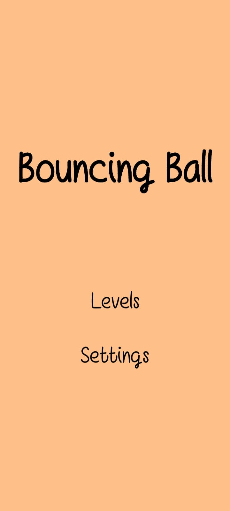
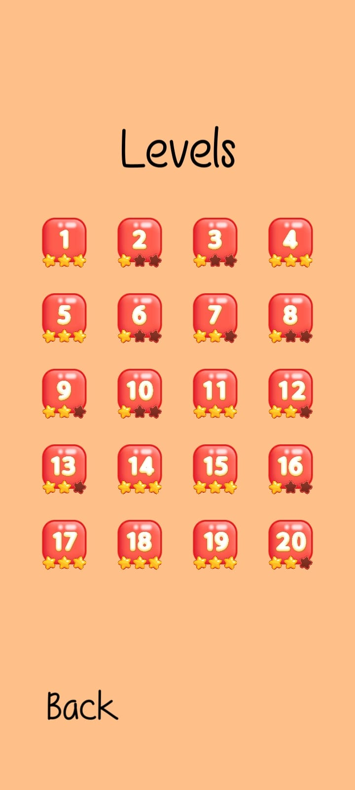
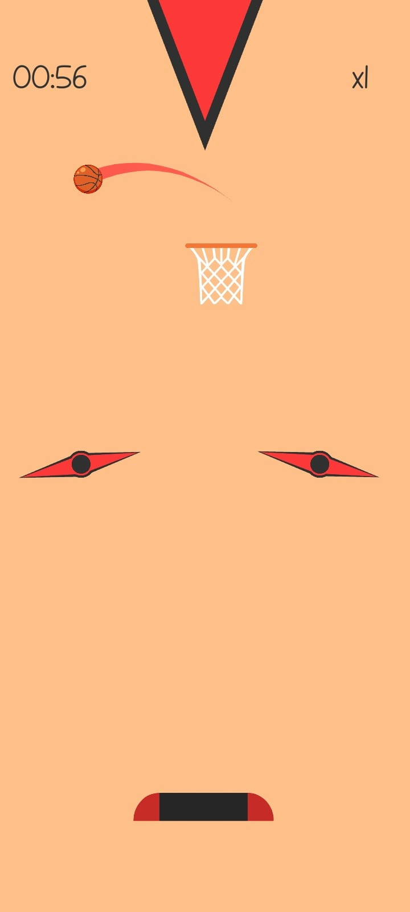
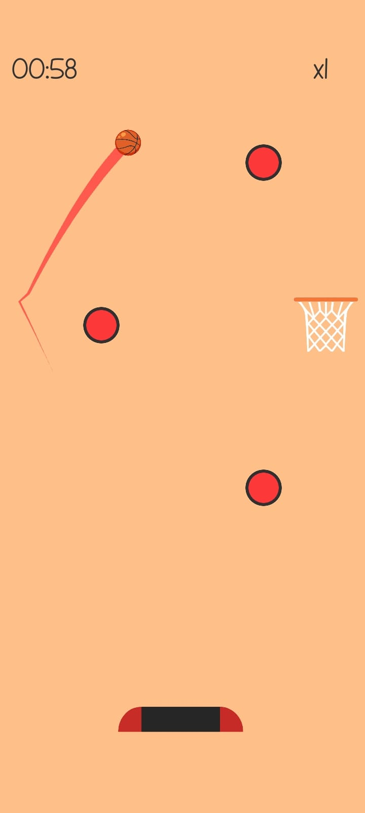
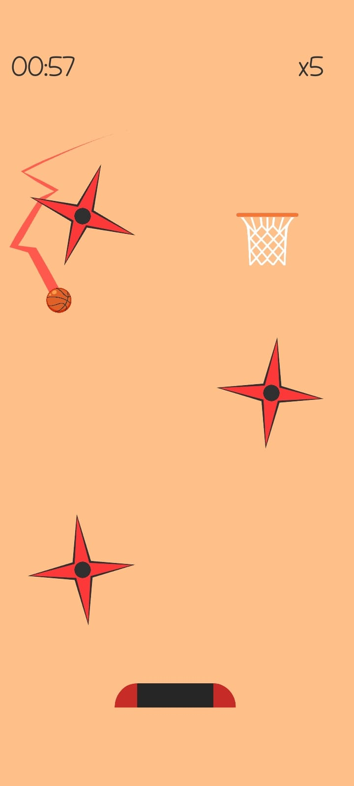
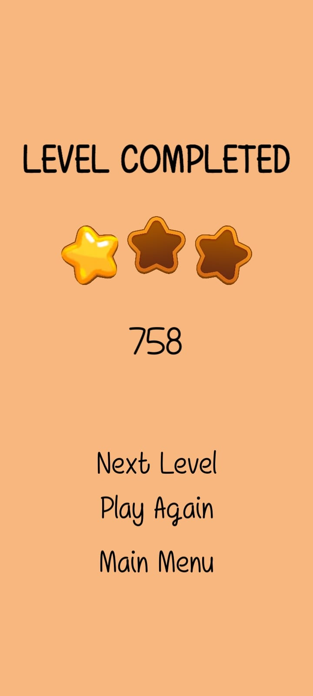

# Unity Bouncing Ball

Bu proje, Unity kullanılarak mobil cihazlar için geliştirilen bir **Hyper Casual** oyunudur. Oyuncular, topu düşürmeden ve engellerden kaçınarak duvarlardan sektirip mümkün olduğunca hızlı bir şekilde basket atmaya çalışır. Eğlenceli ve bağımlılık yapan mekanikleriyle kısa süreli oyun oturumları için idealdir.

## Özellikler

- **Basit Kontroller**: Dokunmatik ekran desteği ile kolay oynanış.
- **Eğlenceli Fizik Mekanikleri**: Topun fiziksel davranışlarını gerçekçi bir şekilde hissettirir.
- **Engeller ve Zorluk Seviyeleri**: Oyunda ilerledikçe daha zorlu engellerle karşılaşılır.
- **Minimalist Grafikler**: Şık ve sade görseller.
- **Puanlama Sistemi**: Hız ve hassasiyet odaklı bir puanlama yapısı.

## Nasıl Oynanır?

1. Oyuncu, ekrana dokunarak topu kontrol eder.
2. Topu duvarlardan sektirerek engelleri aşar.
3. Topu hedefe (basket potasına) ulaştırmaya çalışır.
4. Top hedefe ulaştığında, oyuncuya puan verilir ve bir sonraki zorluk seviyesi başlar.
5. Top yere düşerse oyun sona erer.

## Gereksinimler

- **Unity Sürümü**: 2021.3 veya üzeri
- **Platformlar**: Android ve iOS
- **Geliştirme Ortamı**: Unity Editor

## Kullanılan Teknolojiler

- **Unity Engine**: Oyun geliştirme.
- **C# Scriptleri**: Oyun mekaniği ve iş mantığı.
- **Unity Physics**: Topun fizik davranışlarını oluşturmak için.
- **Unity UI**: Arayüz tasarımı ve oyun içi geri bildirimler.

## Görseller

## Görseller

  
  

  
  

  
  

## Lisans

Bu proje, [MIT Lisansı](LICENSE) kapsamında lisanslanmıştır.
